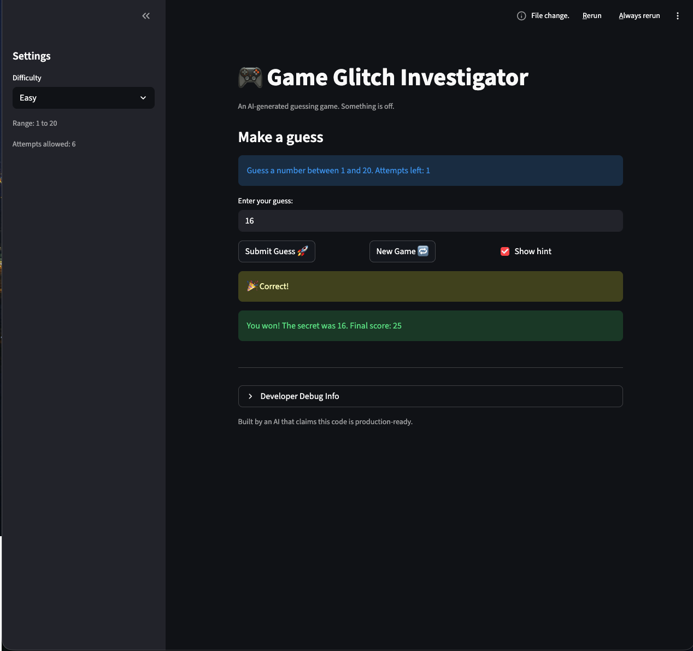
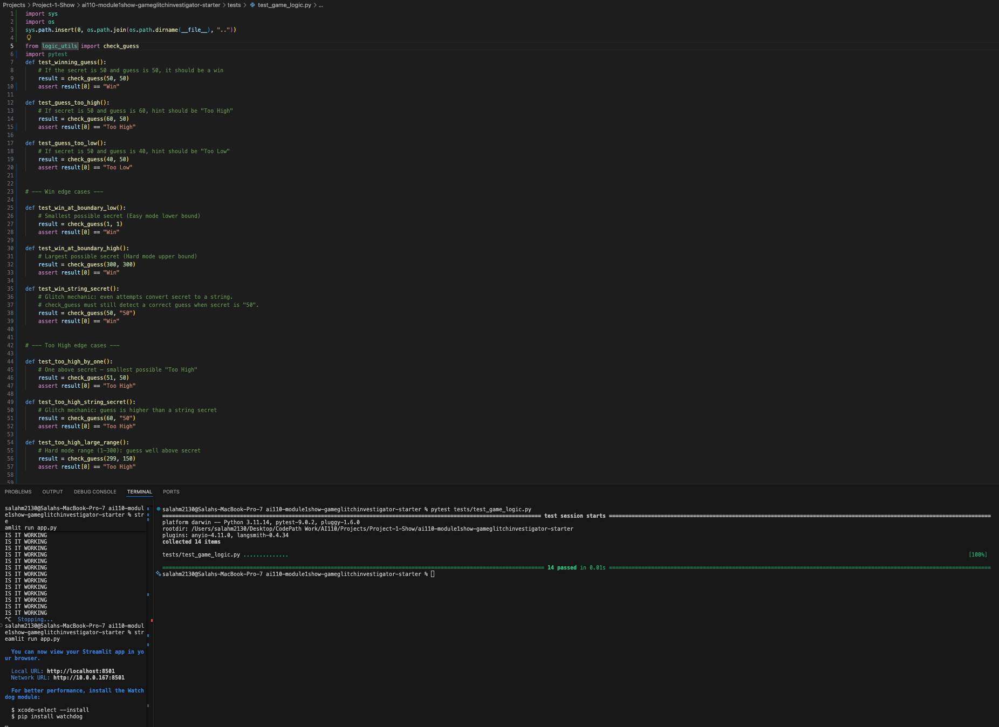

# 🎮 Game Glitch Investigator: The Impossible Guesser

## 🚨 The Situation

You asked an AI to build a simple "Number Guessing Game" using Streamlit.
It wrote the code, ran away, and now the game is unplayable. 

- You can't win.
- The hints lie to you.
- The secret number seems to have commitment issues.

## 🛠️ Setup

1. Install dependencies: `pip install -r requirements.txt`
2. Run the broken app: `python -m streamlit run app.py`

## 🕵️‍♂️ Your Mission

1. **Play the game.** Open the "Developer Debug Info" tab in the app to see the secret number. Try to win.
2. **Find the State Bug.** Why does the secret number change every time you click "Submit"? Ask ChatGPT: *"How do I keep a variable from resetting in Streamlit when I click a button?"*
3. **Fix the Logic.** The hints ("Higher/Lower") are wrong. Fix them.
4. **Refactor & Test.** - Move the logic into `logic_utils.py`.
   - Run `pytest` in your terminal.
   - Keep fixing until all tests pass!

## 📝 Document Your Experience

- [X] Describe the game's purpose.
The games purpose is to provide a great experience for those wanting to test their guessing skills.
- [X] Detail which bugs you found.
1. Guessing Logic was flawed
2. The streamlit reruns was not producing the exact functionality of the game
3. The secret score not updating when changing difficulites.
- [X] Explain what fixes you applied.
1. Guessing Logic was flawed - fixed by changing the logic of how it detects correct and incorrect guesses.
2. The streamlit reruns was not producing the exact functionality of the game - fixed by changing structure of the flow within the app.
3. The secret score not updating when changing difficulites. - fixed by changing logic when button gets clicked to change from easy, medium, and hard

## 📸 Demo

- [X] [Insert a screenshot of your fixed, winning game here]

## 🚀 Stretch Features

- [X] [If you choose to complete Challenge 4, insert a screenshot of your Enhanced Game UI here]

